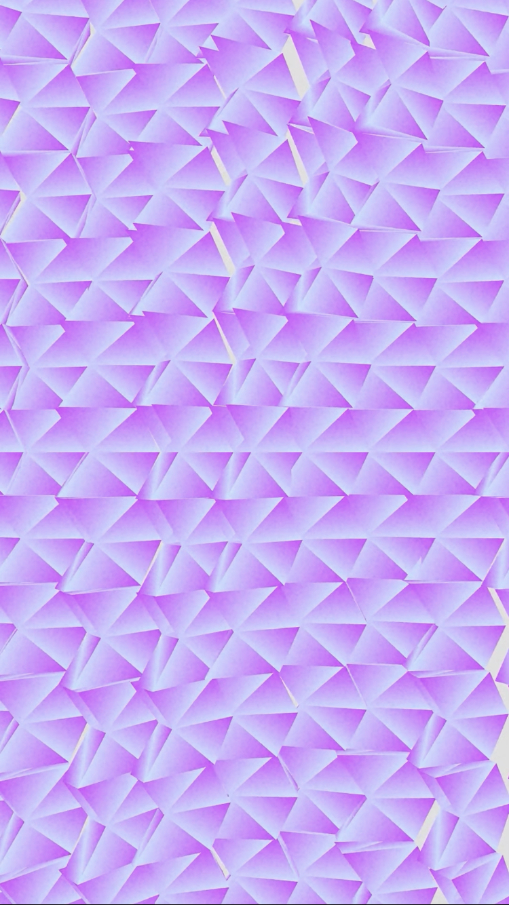
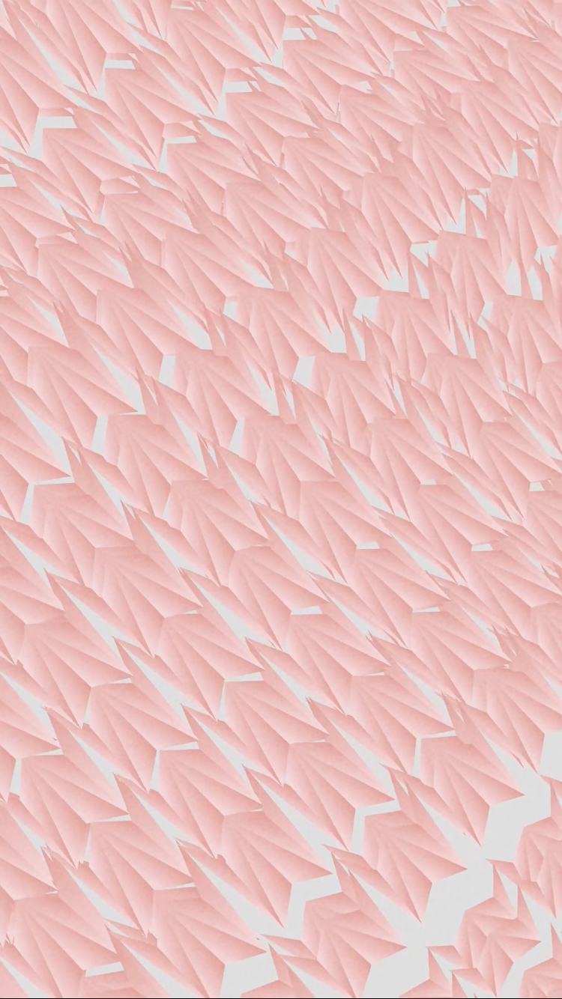
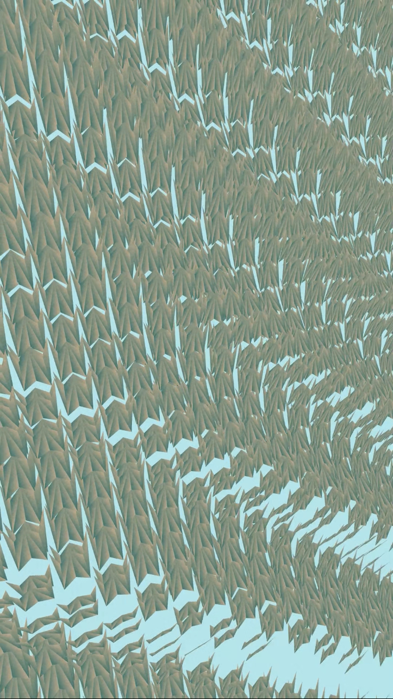

# Wing Scale — Lepidopteran Microstructure Visualization

<video src="https://github.com/user-attachments/assets/3d996f8b-f536-4d54-b220-ae77a528710e" autoplay loop muted playsinline width="100%"></video>

**[→ Open in browser](https://morrisglr.github.io/algo-art-lep-scales/)** — no install required.

---

## What This Is

An algorithmic visualization of butterfly and moth wing microstructure, rendered in real-time with Three.js. ~4,500 individually modeled scales oscillate in a standing wave, with structural coloration and iridescence modeled through custom GLSL shaders.

Inspired by the observation that lepidopteran scales — usually invisible to the naked eye — collectively produce the appearance of fluid motion, much like pixels resolving into image at distance.

## Controls

| Key / Action | Effect |
|---|---|
| `click` | Trigger ripple from cursor |
| `P` | Cycle color palette |
| `R` | Replay animation |
| `C` | Export video |
| `scroll` / pinch | Zoom in / out |
| `#seed=N` | Set color pattern via URL (e.g. `#seed=42`) |

## Technical Notes

- ~4,500 custom 3D meshes (scale geometry)
- Structural coloration and iridescence: custom GLSL shaders (vertex + fragment)
- Real-time Three.js rendering (WebGL)
- No build step — runs directly in browser from `index.html`

## Conceptual Inspiration

Butterfly and moth wings are covered by overlapping scales that give these [lepidopterans](https://en.wikipedia.org/wiki/Lepidoptera) their color and wing patterns. However, the scales are usually too small to be seen individually by the naked eye. Magnified images reveal the repeating scale organization that motivated translating these visuals into algorithmic art. Seeing the individual scales is like looking at the pixels in a digital image — as one zooms out, the scales collectively look like a rolling wave of color.

<table>
  <tr>
    <td align="center">
         
        Eye spot of a moth that I photographed and one can make out the scales when on zooms in. Morris Aguilar. 2017.
    </td>
    <td align="center">
       
      Male luna moth eye spot composed of scales. Peter Znamenskiy. 2008.
    </td>
    <td align="center">
       
      Electron microscope image of a patch of peacock butterfly wing. Shaddack. 2005.
    </td>
  </tr>
</table>
<table>
  <tr>
    <td align="center">
       
      Single Frame of Scales 16 Algo Art. Morris Aguilar. 2023.
    </td>
    <td align="center">
       
      Single Frame of Scales 19 Algo Art. Morris Aguilar. 2023.
    </td>
    <td align="center">
       
      Single Frame of Scales 21 Algo Art. Morris Aguilar. 2023.
    </td>
  </tr>
</table>

## About

Morris Aguilar, M.D./Ph.D., has work spans clinical AI and computational biology. This project is part of the [Computational Art History](https://morrisglr.github.io/creative) series, which translates biological and artistic structures into parametric browser-based systems.

[@morrisglr.bsky.social](https://bsky.app/profile/morrisglr.bsky.social) · [Creative Portfolio](https://morrisglr.github.io/creative) · [LinkedIn](https://www.linkedin.com/in/morris-a-aguilar/)
