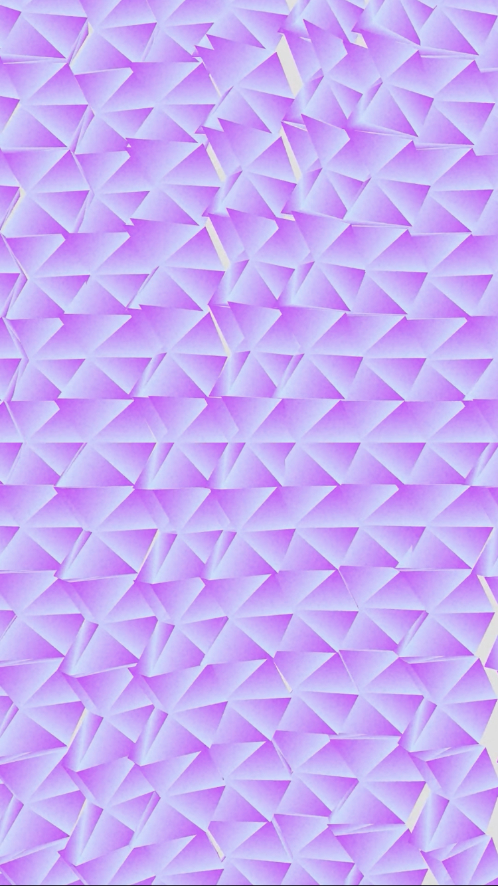

# Lepidopetera Scale Algorithic Art

## Overview
My [algorithmic art](https://en.wikipedia.org/wiki/Algorithmic_art) (algo art) project was inspired by the overlapping scales of butterfly and moth wings. The animation is created using the Three.js library, that allows web browsers to play 3D graphic animations. 

<b>You can view the animation in your own browser by following [this link](https://morrisglr.github.io/algo-art-lep-scales/)!</b>

## Visual Description
I created a simple 3D model of scales placed on a repeating grid pattern. I had the scales gently oscillate to create a wave-like motion. Each animation starts with a close-up of a cluster of scales and slowly zooms out to reveal the entire grid of scales and how, in aggregate, they have motion similar to ripples.

## Conceptual Inspiration
Butterfly and moth wings are covered by overlapping scales that give these [lepidopterans](https://en.wikipedia.org/wiki/Lepidoptera) their color and wing patterns. However, the scales are usually too small to be seen individually by the naked eye. Magnified images reaveal the repeating scale organization that motivated to translate these visuals into algorithmic art. Seeing the individual scales is like looking at the pixels in a digital image and as one zooms out, the scales collectively look like a rolling wave of color.

<table>
  <tr>
    <td align="center">
         
        Eye spot of a moth that I photographed and one can make out the scales when on zooms in. Morris Aguilar. 2017.
    </td>
    <td align="center">
       
      Male luna moth eye spot composed of scales. Peter Znamenskiy. 2008.
    </td>
    <td align="center">
       
      Electron microscope image of a patch of peacock butterfly wing. Shaddack. 2005.
    </td>
  </tr>
</table>
<table>
  <tr>
    <td align="center">
       
      Single Frame of Scales 16 Algo Art. Morris Aguilar. 2023.
    </td>
    <td align="center">
       
      Single Frame of Scales 19 Algo Art. Morris Aguilar. 2023.
    </td>
    <td align="center">
       
      Single Frame of Scales 21 Algo Art. Morris Aguilar. 2023.
    </td>
  </tr>
</table>

## Technical Overview
I made the this project can run directly on any web browser, making it accessible and easy to share. I used the Three.js library to create the 3D environment that would run in a browser. 

# Contact
Morris A. Aguilar, Ph.D. 
@morrisglr.bsky.social
